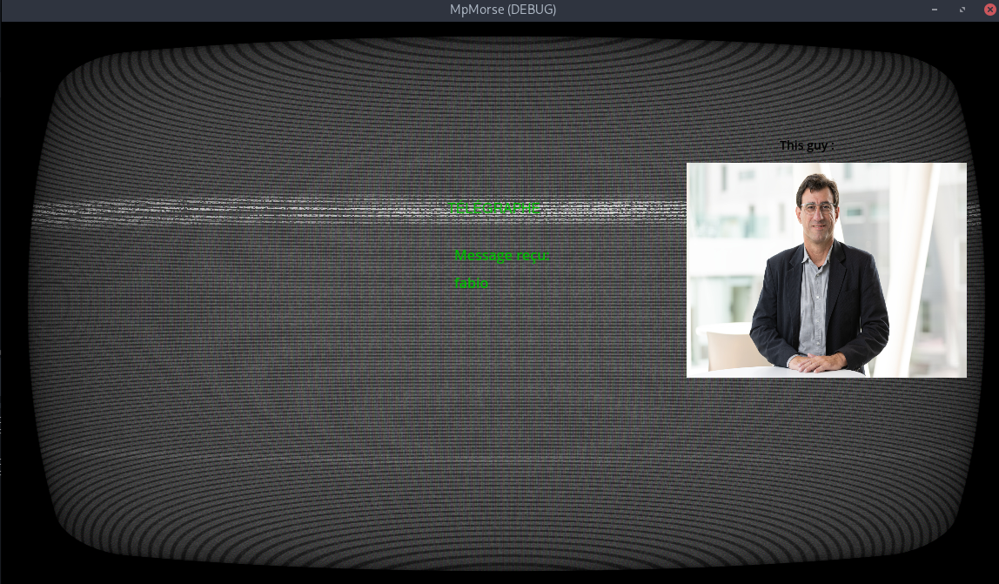
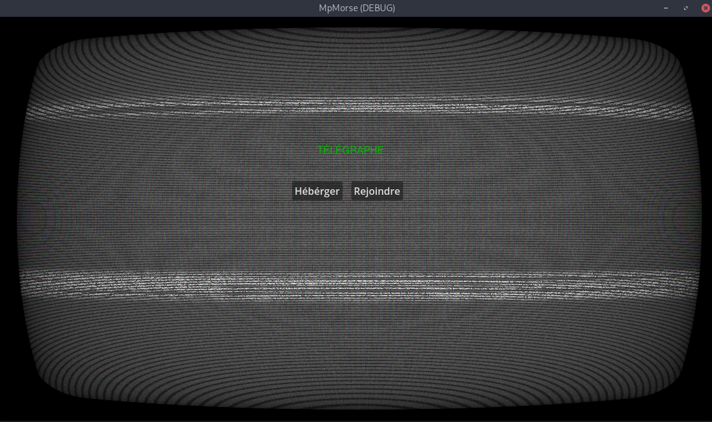

<h1 align=center> Travaux Pratique 05 </h1>
<h2 align=center style="color:grey"><i>Jeux Multiplayer (Godot)</i><h2>
 

<table align=center>
<tr>
<td colspan="2" align="center"></td>
</tr>
<tr>
<td><b>Etudiants</b></td>
<td>Jean-Felix St-Hilaire</td>
</tr>
<tr>
<td><b>Code Permanents</b></td>
<td>STHJ09099500</td>
</tr>
<tr>
<td><b>Cours</b></td>
<td>LOG725</td>
</tr>
<tr>
<td><b>Groupe</b></td>
<td>01</td>
</tr>
<tr>
<td><b>Session</b></td>
<td>Hiver 2024</td>
</tr>
<tr>
<td><b>Charge de   laboratoire</b></td>
<td>Fabio Petrillo</td>
</tr>
<tr>
<td><b>Date</b></td>
<td>28 avril 2024</td>
</tr>

</table>

# Easter Eggs

## 1. SuperTuxKart SFX
Pour faire un rappel sur le Rapport Technique fait lors du cours, j'ai ajouter des sons pour les effets spéciaux (appuyer pour faire un `dot` ou un `dash`) qui font partie des son de SuperTuxKart (que l'on peu retrouvé sur leur repo [SVN ici](http://svn.code.sf.net/p/supertuxkart/code/stk-assets/sfx/))

j'ai ajouter aussi des sons pour : 
- joindre une partie
- commencer une partie (le J1 a transmit un nouveau message a J2)
- Fin d'une partie
    - si nous avons gagner
    - si nous avons perdu

## 2. Image pour Fabio
Lorsque nous transmettons les mots `Fabio`, `Fabio Petrillo` ou `Petrillo`, nous avons une image de Fabio pour nous facilité a comprendre le mots que nous voulons trouvé

l'image a été trouvé sur le site de l'ÉTS

## 3. Shader CRT
Pour faire un rappel sur le cours, j'ai ajouter un Shader pour modifier l'affichage de l'image pour donner un impression d'avoir un [écran CRT](https://fr.wikipedia.org/wiki/Tube_cathodique). 

j'ai intégrer le shader, mais ce n'est pas moi quoi la créer. le code originale provient [d'ici](https://godotshaders.com/shader/VHS-and-CRT-monitor-effect/)