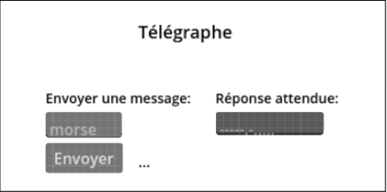
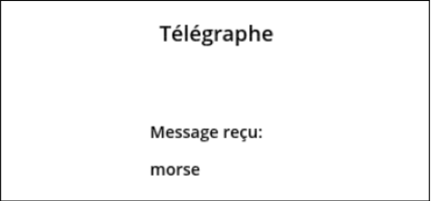

# LOG 725 H2024 - Travail Pratique 5
Dans le TP5, vous allez créer un jeu télégraphe avec 2 parties:
- **Host (J1)** : envoie un message texte à chiffrer.
- **Client (J2)** : essaie de chiffrer le message en code morse.
  
Le projet de base est dans notre [dépot GitHub](https://github.com/guteacher/log725-h24s), dans le repertoire tp5_base. Les échanges entre J1 et J2 sont décrits comme suit :
- Le J1 envoie au J2 un message, par exemple, <<morse>>. Le J1 va chiffrer ce message et va garder la version chiffrée: -----.-....., mais il ne l'envoie pas au J2.
- Le J2 reçoit le message <<morse>>. Le J2 commence à transmettre la version chiffré du message au J1, caractère par caractère.
- À chaque fois que le J1 reçoit un caractère, un son de <<beep>> retentit dans l'ordinateur du J1, comme dans un vrai télégraphe.
- Le J1 va garder chaque caractère reçu et va attendre que la séquence envoyée atteigne le même nombre de caractères que le message chiffrée. Quand cette condition se produit, il va vérifier si la séquence reçue correspond au message chiffrée. Cette vérification est effectuée automatiquement par l'application du J1, pas manuellement par le joueur humain.
    - S'il y a une correspondance parfaite, le J1 envoie au J2 un message de félicitations, puis le J2 est interdit de continuer à transmettre.
    - S'il n'y a pas de correspondance parfaite, le J1 envoie un message d'échec au J2, puis le J2 est interdit de continuer à transmettre.
- Ensuite, si J1 envoie un nouveau message au J2, le jeu recommence et J2 peut alors transmettre à nouveau. En savoir plus: [matériel labo 10](https://ena.etsmtl.ca/mod/resource/view.php?id=1454463)
  
## Référence visuel pour l'implémentation
1) Menu initial: Le joueur peut choisir entre héberger ou rejoindre un jeu.
    
2) **Interface <\<host\>>**: Le joueur peut envoyer un message et voir la réponse attendue en morse, ainsi que la réponse envoyée au fur et à mesure que les caractères sont reçus.
    
3) **Interface <\<client\>>**: Le joueur peut voir le message qu’il doit chiffrer. Il va envoyer les messages morse en appuyant les touches de clavier (par exemple, ARROW UP et ARROW DOWN, ou . et -).
    

## Grille d’évaluation
| Aspect | Description | Note |
| ------ | ----------- | ---- |
| Comportement | ● Le jeu est jouable et suit les règles décrites dans les instructions ci-dessus.   ● La logique de vérification de réussite/échec doit être implémenté.   ● Le J1 doit être capable de redémarrer le jeu à n’importe quel moment en envoyant un nouveau message à chiffrer. |  50/100 |
| Qualité | ● Le code est bien organisé, par exemple : les noms choisis pour les fonctions et variables sont compréhensibles, il n’y a pas de fonctions qui ne sont pas utilisées dans le code, etc.   ● Le composant multiplayer du jeu ne fait que des appels nécessaires entre serveur et client.   ● Si vous utilisez Godot, il faut utiliser au moins 1 méthode avec l’annotation @rpc. | 50/100 |

## Livrable
Le code du jeu dans un dépôt GitHub. Dans Moodle, veuillez informer l'adresse du dépôt GitHub dans un fichier .txt ou .md. Si vous voulez partager un dépôt privé directement avec moi, mon nom d'utilisateur GitHub c'est **<\<nkinesis>\>**